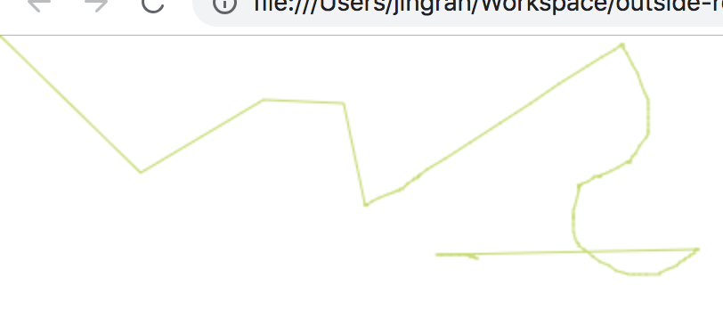

# Summary

## Notes

1. Context:

  Canvas creates a block of actual pixels. You don't draw directly on the `canvas` element in the html, but you draw on something called `context`. The `context` can be 2D or 3D. `getContext()` method returns a drawing context on the convas.
  
2. Drawing paths:

  A path is a list of points, connected by segments of lines that can be of different shapes, curved or not, of different width and of different color. A path, or even a subpath, can be closed.
  
  Steps to make shapes using paths:
  
  * Create the path: 

      `beginPath()` creates a new path. Once created, future drawing commands are directed into the path and used to build the path up.
      
      Internally, paths are stored as a list of sub-paths (lines, arcs, etc) which together form a shape. Every time this method is called, the list is reset and can start drawing new shapes.
      
  * Use drawing commands to draw into the path:
  
      `fill()`, `stroke()`, `drawFocusIfNeeded()`, `scrollPathIntoView()`, `clip()`, `isPointInPath()`, `isPointInStroke()`...
      
      Once the path has been created, can stroke or fill the path to render it.
      
  * An optional step is to call `closePath()`. This method tries to close the shape by *drawing a straight line* from the current point to the start.

      When call `fill()`, any open shapes are closed automatically, so don't have to call `closePath()`. This is **not** the case when you call `stroke()`.
      
    Methods:
    
    * `moveTo(x, y)`: move the *starting point* of a new sub-path to the (x, y) coordinates.
    * `lineTo(x, y)`: connects the last point in the subpath to the x, y coordinates with a *straight line*.

3. Code analysis step by step:

    * `draw()` function:

        1. First draft:
        
            ```
            let isDrawing = false;
            let lastX = 0;
            let lastY = 0;
            
            function draw(e) {
              if (!isDrawing) return;
              
              ctx.beginPath();
              ctx.moveTo(lastX, lastY);
              ctx.lineTo(e.offsetX, e.offsetY);
              ctx.stroke();
            }
            ```
            
    
            Wherever the event point (mouse position) is, all lines start from the top left corner and draw a line to the event point. This is because all lines start from (`lastX`, `lastY`), which is default to (0, 0). So when we've done with drawing, reset (`lastX`, `lastY`).
            
        2. Reset `lastX`, `lastY`

            ```
            let isDrawing = false;
            let lastX = 0;
            let lastY = 0;
            
            function draw(e) {
              if (!isDrawing) return;
              
              ctx.beginPath();
              ctx.moveTo(lastX, lastY);
              ctx.lineTo(e.offsetX, e.offsetY);
              ctx.stroke();
              
              lastX = e.offsetX;
              lastY = e.offsetY;
            }
            ```
            
            
            But after resetting `lastX = e.offsetX; lastY = e.offsetY;`, every line starts off from where I was (where the previous line ended). Also, the first drawing starts from (0, 0).
            
            Change the starting point when mouse down:
            
            ```
            canvas.addEventListener('mousedown', (e) => {
              isDrawing = true;
            
              [lastX, lastY] = [e.offsetX, e.offsetY];
            });
            ```
            
            In the `mousedown` event, update `lastX` and `lastY` to change the starting point of a line into current mouse point.
            
            
            
        3. Update line/stroke styles
        
            * `lineWidth`: sets the width of a line
            * `strokeStyle`: specifies the color or style for the lines
                It can take `color`, `CanvasGradient` obj and `CanvasPattern` obj as options.
            
            * `globalCompositeOperation`: sets the type of compositing operation to apply when drawing new shapes, where type is a string identifying which of the compositing or blending mode operations to use.
            