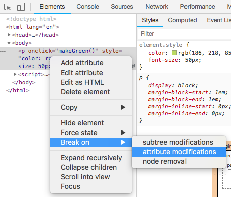
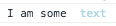
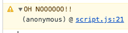
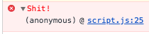
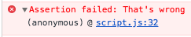
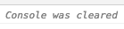
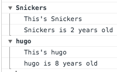
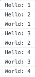
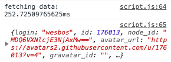

# Summary

## Notes

1. Attribute modifications

    Shows what part of JS makes changes to an element.
    
    
    
2. `.log` more usages: (Template literals in ES6)

    * `%s` a String value
    * `%d` or `%i` an integer
    * `%f` a floating point number
    * `%o` object
    * `%c` style input text
        
        EX. `console.log('I am some %c text', 'color: lightblue');`
        
        
        
3. `.warn()` warning

    `console.warn('OH NOOOOOO!!');`
    
    
    
4. `.error()` display an error

    `console.error('Shit!');`
    
    
    
5. `.info` 
6. `.assert(assertion, msg/obj)` tests if something is wrong. If the assertion is false, writes an error msg. Otherwise, nothing happens.

    ```
    console.assert(1 === 1, `That's wrong`);
    console.assert(1 === 2, `That's wrong`);
    ```

    
    
7. `.clear()` clear the console

    
    
8. `.dir` view all the properties and methods of an element
9. `.group([label])` / `.groupCollapsed([label])` and `.groupEnd([label])`

    Creates a new inline group in the console, until `console.groupEnd()` is called. Label for a group is optional.
    
    
    
10. `.count([label])` logs the number of times that this particular call to `count()` has been called.

    ```
    console.count('Hello');
    console.count('Hello');
    console.count('World');
    console.count('Hello');
    console.count('World');
    console.count('Hello');
    console.count('World');
    console.count('World');
    ```
    
    
    
11. How long something takes:

    Start a timer: `console.time()`
    
    Stop a timer: `console.timeEnd()`
    
    